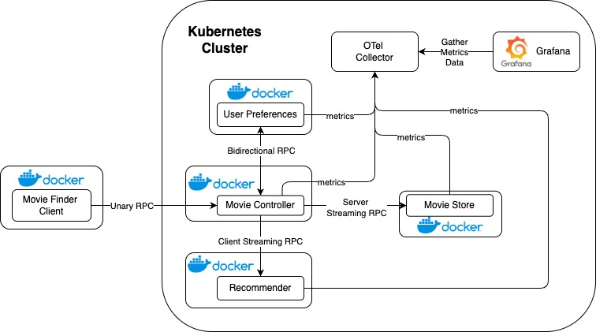

# Java - gRPC - OTel application
Thursdays at 8:45 AM, 2025

## Authors
- Mateusz Waga
- Witold Strzeboński
- Jacek Urbanowicz
- Mateusz Więcek

## Introduction
The goal is to demonstrate the use of microservices in Java communicating via gRPC, with full observability enabled through OpenTelemetry and Grafana. The application is based on a ready-made, [open-source microservices project](https://nikhilm.com/blogs/grpc-in-action---example-using-java-microservices), extended and instrumented to meet observability and infrastructure criteria.

The selected application, titled "Movie Finder", showcases the use of gRPC communication between microservices to build a lightweight and efficient movie recommendation system. It consists of four distinct services that collaborate to deliver personalized recommendations based on user preferences. The services communicate using different gRPC patterns (unary, server/client streaming, and bidirectional streaming), which makes the project a valuable case study for learning both gRPC and microservice architecture in practice.

The project also integrates observability tools such as OpenTelemetry for tracing, metrics and logs, and Grafana for visualization, following current best practices for monitoring distributed systems.

## Technology stack
The project uses the following technologies:
- **Java** – primary programming language for implementing microservices
- **gRPC** – a modern, high-performance Remote Procedure Call (RPC) framework that enables efficient inter-service communication
- **Protocol Buffers (Protobuf)** – a language-neutral, platform-neutral extensible mechanism for serializing structured data; used to define service contracts in gRPC
- **Docker** – used for containerizing services, ensuring portability and consistency across environments
- **Kubernetes** – used to orchestrate the deployment of containerized services in production-like environments
- **OpenTelemetry** – provides a standard way to collect, process, and export telemetry data such as traces, metrics, and logs
- **Grafana** – a visualization platform used to display telemetry data and monitor the health and performance of services

The project demonstrates all four types of gRPC communication:
- **Unary RPC** – One request followed by one response.
- **Server-side streaming RPC** – one request followed by a stream of responses
- **Client-side streaming RPC** – a stream of requests followed by one response
- **Bidirectional streaming RPC** – both client and server send a stream of messages

## Case study concept description
[CNCF blog post - Movie Finder App](https://www.cncf.io/blog/2021/08/04/grpc-in-action-example-using-java-microservices/)


### Demo Overview

"Movie Finder" project demonstrates a microservice architecture with gRPC serving as the communication backbone.

The application processes user requests to recommend movies based on genre preferences. It consists of four microservices:

- MovieController: Acts as the entry point, handling client requests.
- MovieStore: Maintains a repository of movies categorized by genre.
- UserPreferences: Filters movies based on user-specific preferences.
- Recommender: Selects a final movie recommendation from the filtered list.

Each microservice operates independently, communicating exclusively through gRPC, showcasing all four gRPC communication patterns.

### Goal

Our main goal is to provide telemetry metrics to the system and measure its performance which requires some additional modification to the provided example application.

### Demo Design

#### Adding OTel

To add Open Telemetry to our project we need to instantiate a `OTel Collector` for each of the applications to measure data like processed requests count and expose ports for collecting these metrics from grafana

#### Containerization and Deployment

Docker images need to be created for each of the services to allow for containerized deployment of the application

Kubernetes deployments and services need to be created to allow for deployement on a kubernetes cluster.

#### Setting up metrics and observability

OTel collector and Grafana need to be deployed to the kubernetes cluster. 

OTel collector needs to be set up to gather data from each of the services and Grafana needs to be connected to OTel collector as a data source. Grafana dashboards need to be created or imported to visualize data gathered from the services.



#### Commands to setup docker containers
To deploy project on kubernetes run following commands and then start client.
```
docker build -t movie-controller:local .
docker build -t movie-recommender:local .
docker build -t movie-store:local .
docker build -t user-preferences:local .

kubectl apply -f namespace.yaml
kubectl apply -f movie-controller.yaml
kubectl apply -f movie-recommender.yaml
kubectl apply -f movie-store.yaml
kubectl apply -f user-preferences.yaml

kubectl port-forward svc/movie-controller 50051:50051 -n movie-app
```